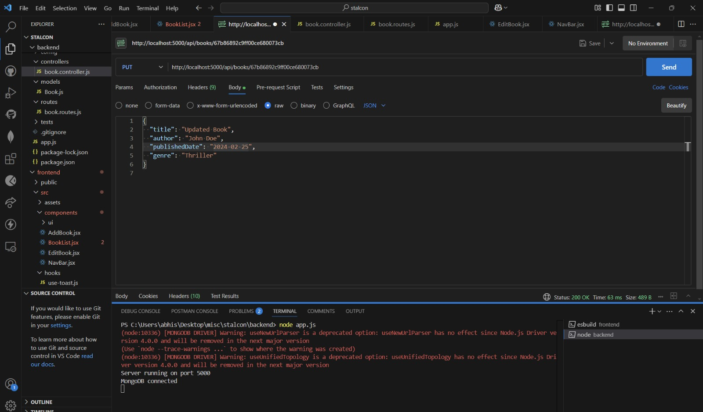

# Book Management System

A full-stack web application for managing books, providing CRUD operations using the MERN stack (MongoDB, Express.js, React, Node.js) and modern development practices.


Ensure you have the following installed:

*   [Node.js](https://nodejs.org/) (v18 or higher)
*   [MongoDB](https://www.mongodb.com/) (local or [MongoDB Atlas](https://www.mongodb.com/cloud/atlas))
*   [Git](https://git-scm.com/)

## Project Structure

```
.
├── backend/               # Express.js server
│   ├── config/           # Database configuration
│   ├── controllers/      # Request handlers
│   ├── models/          # Database models
│   ├── routes/          # API routes
│   └── tests/           # Backend tests
└── frontend/            # React application
    ├── src/
    │   ├── components/  # React components
    │   ├── hooks/       # Custom React hooks
    │   └── lib/         # Utility functions
```

## Setup Instructions

### Backend Setup

1.  Navigate to the backend directory:

    ```bash
    cd backend
    ```
2.  Install dependencies:

    ```bash
    npm install
    ```
3.  Create a `.env` file in the backend directory:

    ```env
    PORT=5000
    MONGO_URI=your_mongodb_connection_string
    ```
4.  Start the backend server:

    ```bash
    node server.js
    ```

    For development with auto-reload:

    ```bash
    npm install -g nodemon
    nodemon server.js
    ```

### Frontend Setup

1.  Navigate to the frontend directory:

    ```bash
    cd frontend
    ```
2.  Install dependencies:

    ```bash
    npm install
    ```
3.  Create a `.env` file in the frontend directory:

    ```env
    VITE_API_URL=http://localhost:5000/api
    ```
4.  Start the development server:

    ```bash
    npm run dev
    ```

## Testing

### Backend Tests

Run the backend tests:

```bash
cd backend
npm test
```

## API Endpoints

### Books API

*   `GET /api/books` - Get paginated list of books
*   `GET /api/books/all` - Get all books
*   `GET /api/books/:id` - Get a specific book
*   `POST /api/books` - Create a new book
*   `PUT /api/books/:id` - Update a book
*   `DELETE /api/books/:id` - Delete a book

## Deployment

### Backend Deployment (Vercel)

The backend is configured for deployment on Vercel using the `vercel.json` configuration file.

### Frontend Deployment

The frontend can be deployed to any static hosting service. For Vercel:

1.  Build the project:

    ```bash
    npm run build
    ```
2.  Deploy the `dist` directory.

## Environment Variables

### Backend Variables

*   `PORT`: Server port (default: 5000)
*   `MONGO_URI`: MongoDB connection string

### Frontend Variables

*   `VITE_API_URL`: Backend API URL

## Technologies Used

### Backend

*   [Express.js](https://expressjs.com/)
*   [MongoDB](https://www.mongodb.com/) with [Mongoose](https://mongoosejs.com/)
*   [JSON Web Tokens (JWT)](https://jwt.io/) for authentication
*   [Joi](https://joi.dev/) for validation
*   [Jest](https://jestjs.io/) for testing
*   [CORS](https://github.com/expressjs/cors) for cross-origin resource sharing

### Frontend

*   [React](https://react.dev/) with [Vite](https://vitejs.dev/)
*   [React Router](https://reactrouter.com/en/main) for navigation
*   [Tailwind CSS](https://tailwindcss.com/) for styling
*   [shadcn/ui](https://ui.shadcn.com/) for UI components
*   [React Hook Form](https://react-hook-form.com/) for form handling
*   [Zod](https://zod.dev/) for validation
*   [Axios](https://axios-http.com/docs/intro) for API requests
*   [Sonner](https://sonner.emilkowal.ski/) for toast notifications

## Error Handling

The application implements comprehensive error handling:

*   Backend validation using Joi
*   Frontend form validation using Zod
*   Toast notifications for user feedback
*   HTTP error handling with appropriate status codes

## Postman and cURL Examples

### Create a new book

**cURL:**

```bash
curl -X POST -H "Content-Type: application/json" -d '{
  "title": "The Lord of the Rings",
  "author": "J.R.R. Tolkien",
  "genre": "Fantasy",
  "publicationYear": 1954
}' http://localhost:5000/api/books
```

### Get book by ID

**cURL:**

```bash
curl http://localhost:5000/api/books/{bookId}
```

Replace `{bookId}` with the actual ID of the book.

### Update book by ID

**cURL:**

```bash
curl -X PUT -H "Content-Type: application/json" -d '{
  "title": "The Hobbit",
  "author": "J.R.R. Tolkien",
  "genre": "Fantasy",
  "publicationYear": 1937
}' http://localhost:5000/api/books/{bookId}
```

Replace `{bookId}` with the actual ID of the book.

### Delete book by ID

**cURL:**

```bash
curl -X DELETE http://localhost:5000/api/books/{bookId}
```

Replace `{bookId}` with the actual ID of the book.

## Postman Tests

*   Add a new book

    ![Add book Postman test][def]
*   Get book by id

    
*   Update book by id

    
*   Remove book by id

    ![Delete book by ID Postman test][def2]

[def]: image.png
[def2]: image-3.png